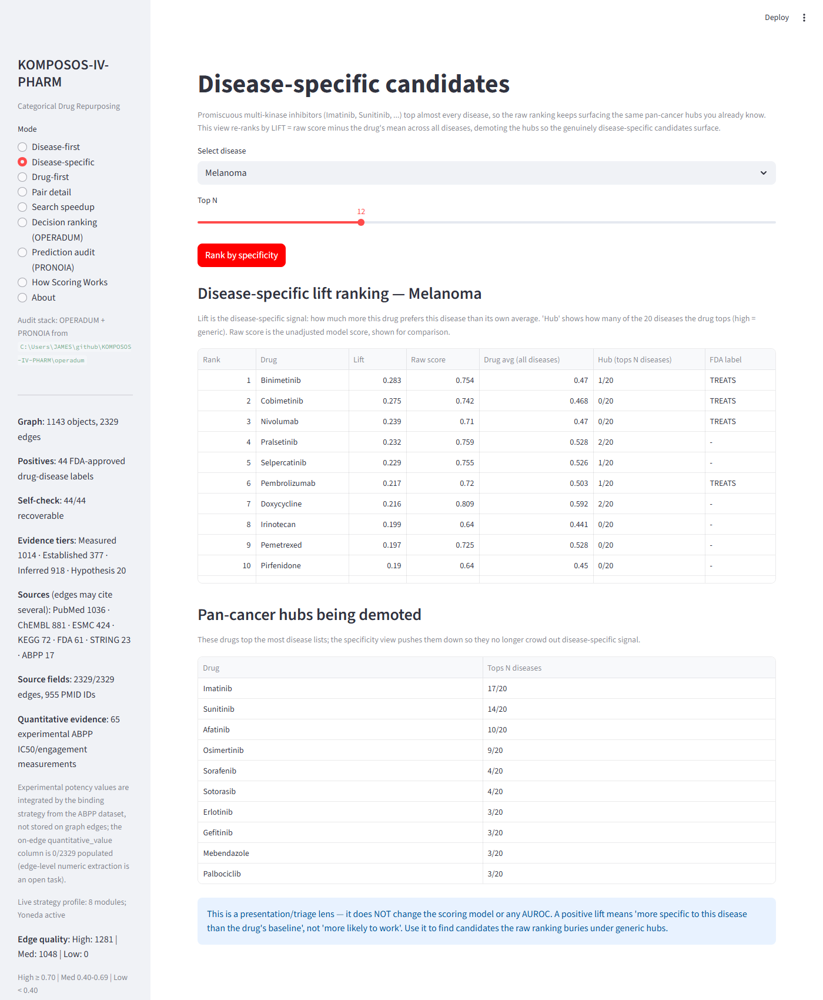

# KOMPOSOS-IV-PHARM

A categorical AI runtime applied to pharmaceutical discovery.

- **Working capability (Track A):** drug *repurposing* over a curated
  drug–target–disease graph — ranking which drugs plausibly act on which
  diseases, with source-linked mechanistic evidence chains.
- **Long-term goal (Track B):** de-novo drug *design* (molecular generation,
  binding/efficacy/safety, ADMET). Not scientifically validated in this repo —
  do not read Track A metrics as Track B readiness.

Author: James Ray Hawkins · License: Apache 2.0 / Commercial dual license · Python 3.10+

> **Status:** working research prototype, **not** clinical or translational
> validation. Every AUROC below names its graph view, protocol, pair count,
> positive count, and label policy — see `CLAUDE.md` for the full audit trail.
>
> **Read [`HONEST_VALUE.md`](HONEST_VALUE.md) first** for a deliberately
> conservative, self-critical account of what this system is and is not worth.

---

## Headline result (Track A)

Strict validation, `full_typed` view, `remove_direct_labels` protocol (the
direct Drug→Disease label is removed before scoring, so the ranker cannot read
the answer it is graded on):

```powershell
python validation\repurposing_benchmark.py --view full_typed --protocol remove_direct_labels --baselines --ci
```

- **AUROC 0.9705** [0.9519, 0.9844], AUPRC 0.5464 [0.4025, 0.6890]
- Hits@5 1.00, Hits@10 0.60 · 44 FDA `treats` positives over 1,560 pairs
- **+0.35** over the strongest graph baseline (common_neighbor 0.6219)

Reality checks (also executable): external Hetionet AUROC 0.644 / AUPRC 0.010;
temporal holdout (approvals after 2013) AUROC 0.971 / AUPRC 0.194; disease-level
holdout mean AUROC 0.938. In-graph recovery is strong; novel-pair precision at
the very top of the list is the open question.

---

## Search speedup (enrichment funnel)

The practical value isn't "the AI finds cures" — it's that it reorders a
1,560-pair search with a 2.8% base hit rate into a short list that is far denser
in real hits, so a scientist screens a fraction of the candidates and still
catches most of them. Measured under the strict protocol above:

**Search space:** 1560 drug-disease pairs | 44 known positives | base rate 2.82% | protocol `remove_direct_labels` (strict)

| Screen top | Pairs | Capture | Enrichment vs random |
|---|---|---|---|
| 5% | 78 | 32/44 (73%) | **14.5x** |
| 10% | 156 | 41/44 (93%) | **9.3x** |
| 20% | 312 | 43/44 (98%) | **4.9x** |

- Capture **50%** of known hits by screening **2%** of the list (skip 98%).
- Capture **80%** of known hits by screening **7%** of the list (skip 93%).
- Capture **100%** of known hits by screening **37%** of the list (skip 63%).

_Measured on **known** positives (recovery), so this quantifies search
acceleration on the curated graph — not a novel-discovery hit rate. For
genuinely novel pairs, top-of-list precision is lower (Hetionet check); the
temporal holdout shows the lift does not fully collapse on unseen approvals._

Regenerate any time the graph changes:

```powershell
python -m validation.enrichment_funnel              # terminal table
python -m validation.enrichment_funnel --markdown   # this section
python -m validation.enrichment_funnel --json       # structured output
```

---

## Disease-specific candidates (demote the hubs)

Promiscuous multi-kinase inhibitors top almost every disease — Imatinib lands in
17 of 20 disease top-5 lists — so the raw ranking keeps surfacing pan-cancer
hubs you already know. The **Disease-specific** view re-ranks by
`lift = raw score − the drug's mean across all diseases`, demoting the hubs so
the genuinely disease-specific candidates surface. On Melanoma this promotes the
actual approved MEK/checkpoint drugs (Binimetinib, Cobimetinib, Nivolumab,
Pembrolizumab) that the raw ranking buries. It is a presentation lens — it does
**not** change the scoring model or any AUROC.



```powershell
python -m validation.disease_specificity Melanoma   # or open the "Disease-specific" UI mode
```

---

## Quickstart

```powershell
# Rank all drugs for a disease (evidence chains, provenance, labels)
python validation\triage.py Melanoma

# Disease-specific candidates (demote the pan-cancer hub drugs)
python -m validation.disease_specificity Melanoma

# Rank all diseases for a drug
python validation\triage.py --drug Sorafenib

# Reproduce the strict benchmark
python validation\repurposing_benchmark.py --view full_typed --protocol remove_direct_labels --baselines --ci

# Interactive web app (Disease-first / Drug-first / Pair detail / Search speedup / ...)
streamlit run app.py
```

---

## How it works (briefly)

Scoring combines nine oracle strategies — dominated by confidence-weighted
**mechanistic path composition** (Drug→Protein→Disease) plus a structural
**Yoneda similarity** bonus and a **binding-evidence** strategy (ABPP IC50s,
drug-likeness). Provenance is tiered honestly: `RELATION-VERIFIED` (agent-
confirmed directed/signed relation) vs `LEXICAL-COOCCURRENCE` (automated screen
only). The `OPERADUM` decision layer ranks *which candidate to back next* on top
of Track A scores. See `CLAUDE.md` and `TECHNICAL_OVERVIEW.md` for architecture,
strategies, validation, and limitations.

## Scientific rules

1. Code and database queries outrank docs.
2. Every AUROC must specify view, protocol, pair count, positive count, label policy.
3. Direct Drug→Disease labels must be removed or held out for stronger claims.
4. Unlabeled pairs are open-world unknowns, not confirmed negatives.
5. Do not represent fallback/mock modules as production capability.

## Verification

```powershell
pytest tests\test_repurposing_benchmark.py -q   # focused regression
pytest tests -q                                  # full suite
```
